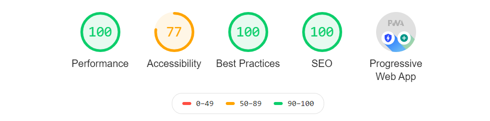

# Playground to test react hooks

PWA React based application created to play with newset features of React and more. 
Deplyed to heroku server ar: https://kp-playground-taskapp.herokuapp.com/
Passing Lighthouse audit:
<p>
    
</p>

## Built With

* [React](https://reactjs.org/) - Javascript library for building user interfaces
* [react-router-dom](https://www.npmjs.com/package/react-router-dom) - application routing
* [Express as server](https://expressjs.com/)
* [babel](https://babeljs.io/) - Javascript Compilator to use latest generation of JavaScript
* [webpack](https://webpack.js.org/) - module bundler
* [formik](https://github.com/jaredpalmer/formik) - for creating powerful forms easly
* [yup](https://github.com/jquense/yup) - JavaScript schema builder for form validation
* [reactstrap](https://reactstrap.github.io/) - bootstrap 4 components for React for creating layout
* [mongodb/mongoose](https://www.mongodb.com/) - database
* [jest](https://jestjs.io/) - JavaScript Testing Framework for testing back end


## Getting Started

These instructions will get you a copy of the project up and running on your local machine for development and testing purposes. See deployment for notes on how to deploy the project on a live system.

### Prerequisites

What things you need to install the software and how to install them

```
Give examples
```

### Installing

A step by step series of examples that tell you how to get a development env running

Say what the step will be

```
Give the example
```

And repeat

```
until finished
```

End with an example of getting some data out of the system or using it for a little demo

## Running the tests

Explain how to run the automated tests for this system

### Break down into end to end tests

Explain what these tests test and why

```
Give an example
```

### And coding style tests

Explain what these tests test and why

```
Give an example
```

## Deployment

Add additional notes about how to deploy this on a live system

## Built With

* [Dropwizard](http://www.dropwizard.io/1.0.2/docs/) - The web framework used
* [Maven](https://maven.apache.org/) - Dependency Management
* [ROME](https://rometools.github.io/rome/) - Used to generate RSS Feeds

